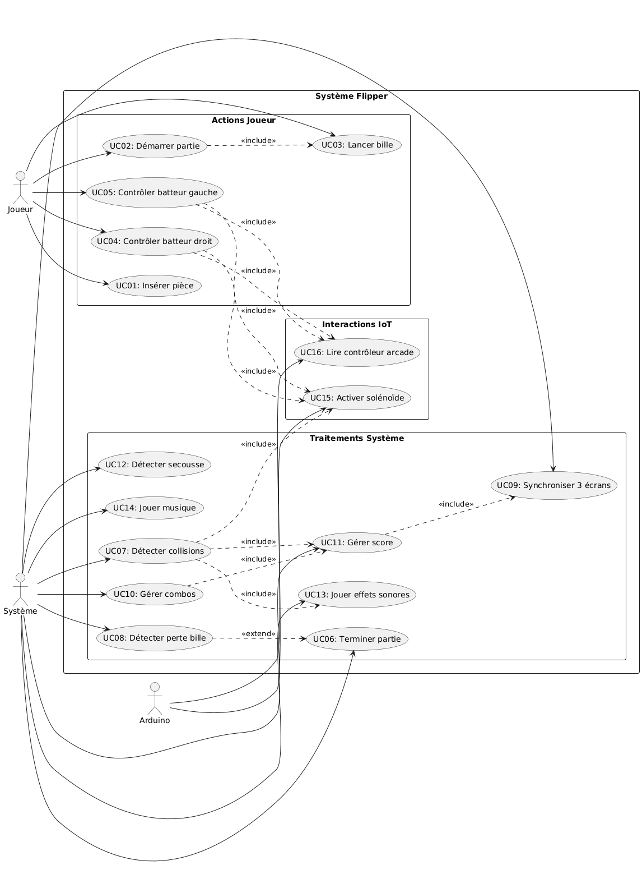
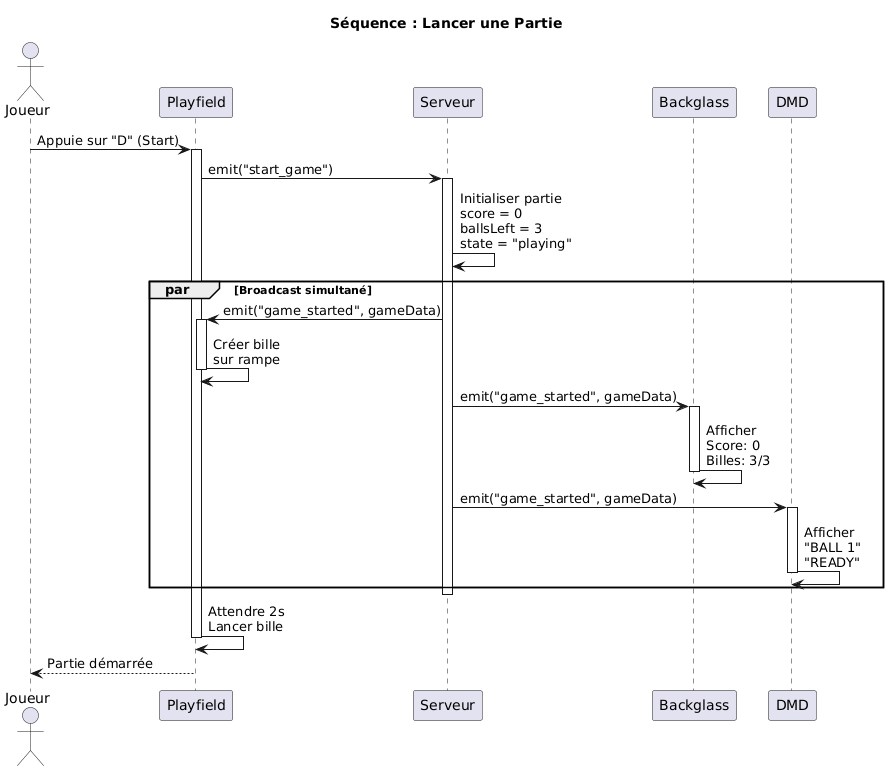
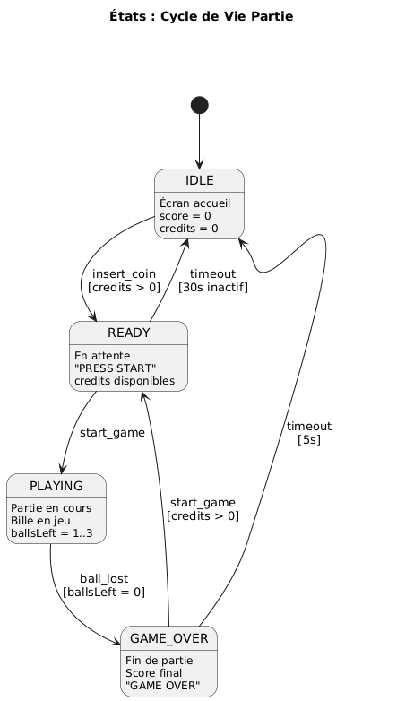

# Diagrammes UML

Au minimum 3 diagrammes sont attendus pour le CDC. **Placer dans le dossier** `docs/hetic/diagrammes/` les PNG exportés, avec les noms ci-dessous, pour que les aperçus s’affichent :

1. **Use case — Système Flipper** → `usecasediagram.png`  
2. **Séquence — Lancer une partie** → `sequencediagram.png`  
3. **États — Cycle de vie partie** → `statediagram.png`  

---

## 1. Use case (Système Flipper)

Acteurs : Joueur, Système, Arduino. Packages : Actions Joueur, Interactions IoT, Traitements Système. Use cases UC01–UC12 avec relations include/extend.

---

## 2. Séquence — Lancer une partie

Joueur → Playfield → Serveur (start_game) ; Serveur initialise score, ballsLeft, state ; broadcast game_started vers Playfield, Backglass, DMD ; création bille, affichage score et messages.

---

## 3. États — Cycle de vie partie

IDLE → PLAYING (start_game) → GAME_OVER (ball_lost, ballsLeft=0) ; retour IDLE automatiquement après ~6 secondes ou via start_game. Pas d'état READY ni d'événement insert_coin.

